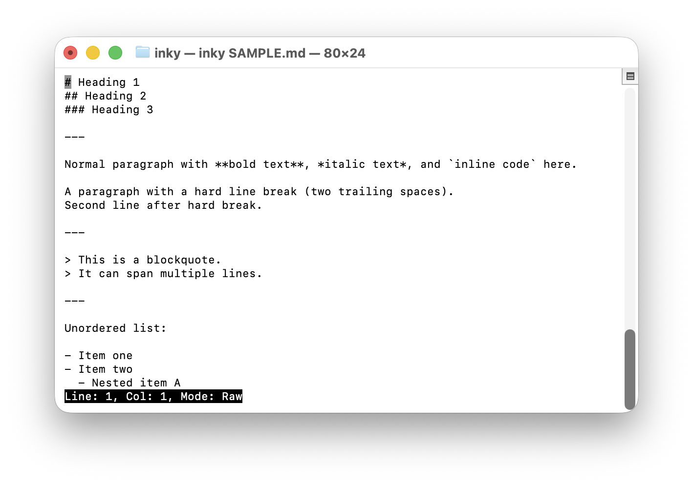
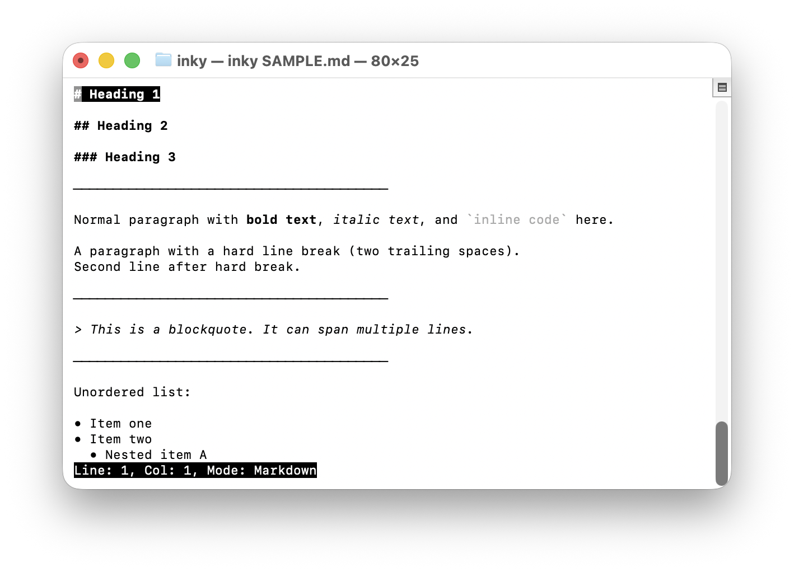

### Inky - A modular text editor

Inky is primarily a markdown terminal-based text editor written purely in Go.

The beauty of Inky is that every piece of it is modular. By default, it uses a gap buffer, renders markdown and is terminal-based.
If you wish to swap the buffer to a rope, or render it in another format, simply create your implementation that satisfies the interfaces and you should be good to go.

### Quickstart

Compile the Go program and run it.

```go
go build .
./inky <your markdown file>
```

**Default Key Bindings**

| Action          | Key        |
| --------------- | ---------- |
| Save            | `Ctrl-S`   |
| Undo            | `Ctrl-U`   |
| Redo            | `Ctrl-R`   |
| Shutdown        | `Ctrl-D`   |
| Toggle mode     | `Esc`      |
| Cursor Movement | Arrow Keys |

### Screenshots

**Inky in raw text edit mode**


**Inky in markdown rendering mode**


### Motivation

Inky started out as a personal markdown terminal-based text editor back in late 2024. I wanted to write more for my personal blog and thought it would be fun to implement my own editor. I'm also a fan of terminal editors like Vim, so I took on the challenge of creating a terminal-based editor.

Much procrastination later, I'm glad to finally release Inky. Now time to get writing on my personal blog.

### TODOs

Here are some features that I wish to add to Inky:

- [ ] Improve editor performance (Gap Buffer and eagerly loading the entire file into memory isn't it)
- [ ] An alternate user interface to terminal
- [ ] Custom key mappings
- [ ] Create my own Markdown parser and make it incremental (currently using [yuin/goldmark](https://github.com/yuin/goldmark))
- [ ] More editor status information
- [ ] Add support for other terminal types
